# Hi 👋 My name is Xiaopeng Ye

### 🌍 Based in Spain
### 🧠 Currently learning Golang
### 👥 Looking to collaborate on AI Agent projects

[Portfolio](http://xiaopengye.kkcloud.org) • [xiaopengye@kkcloud.org](mailto:xiaopengye@kkcloud.org)

---

### 🛠️ Tech Stack

  <!-- Languages -->
  
  
  
  
  
  <!-- Frontend -->
  
  
  
  
  
  
  <!-- Backend -->
  
  
  
  
  
  

  <!-- Databases -->
  
  
  
  <!-- Tools & DevOps -->
  
  
  
  
  
  
  <!-- AI & ML -->
  
  

---

### 📫 Socials

  
  

---

### 📊 GitHub Stats

<picture>
  <source media="(prefers-color-scheme: dark)" srcset="https://raw.githubusercontent.com/xiaopeng-ye/xiaopeng-ye/output/github-contribution-grid-snake-dark.svg">
  <source media="(prefers-color-scheme: light)" srcset="https://raw.githubusercontent.com/xiaopeng-ye/xiaopeng-ye/output/github-contribution-grid-snake.svg">
  
</picture>

  

<!-- 

  
  

 -->

